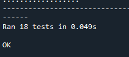

# CNYT 2024-2
# Números complejos
## Libreria de números complejos
### Descripción
Esta librería está diseñada para manejar números complejos, que son fundamentales en la computación cuántica, encontrarás herramientas para realizar operaciones básicas con números complejos, como suma, resta, multiplicación y división, así como funciones para calcular el conjugado, el módulo, conversión entre representaciones polar y cartesiano, en los dos sentidos y la fase de un número complejo.
### Prerrequisitos
Es necesario tener instalado [Python 3.8](https://www.python.org/)
<p>Para ejecutar las pruebas automaticas es necesario descargar TestLibCplx.py y LibreriaCplx.py, ambos archivos deben estar en una misma carpeta para que se puedan ejecutar las pruebas</p>

### Ejecutando las pruebas
<p>Para ejecutar las pruebas automaticas se debe abrir el archivo TestLibCplx.py y correrlo.</p>



Para ejecutar cada funcion por tu cuenta solo necesitas pegar el siguiente codigo en LibreriaCplx.py, donde __a__ es un número complejo que se debe representar en forma de pares ordenados, **b** se debe representar de la misma manera.</p>


```python
if __name__ == '__main__':
    a=(3,2.8)
    b=(1.5,-2)
    partReal,partImag=sumaC(a,b)
    prettyPrintingC(partReal,partImag)
    partReal,partImag=multC(a,b)  
    prettyPrintingC(partReal,partImag)
    partReal,partImag=divC(a,b)
    prettyPrintingC(partReal,partImag)
    partReal,partImag=restaC(a,b)
    prettyPrintingC(partReal,partImag)
    print(moduloC(5,2))
    print(conjugadoC(5,-2))
    print(polarC(5,2))
    print(cartesianoC(5,0.6))
    print(faseC(5,2))
```

<p>Puedes usar las funciones que desees y modificar los valores de acuerdo a tus necesidades.</p>

## Espacios vectoriales complejos
### Descripción
Esta carpeta contiene cuatro talleres, los cuales fueron asignados con el fin de aprender y practicar diferentes operaciones que se pueden aplicar a los vectores y matrices en el mundo de los números complejos, algunos de los temas que se tocan en los talleres son:

- Operaciones basicas entre números complejos.
- Suma, resta, multiplicación y division de vectores y matrices complejas.
- Calculo de valores y vectores propios de una matriz.
- Calculo del producto interno entre dos vectores o matrices.
- Matrices Hermitianas y unitarias.
- Producto tensor en vectores y matrices

### Prerrequisitos
Antes de empezar, debes asegúrate de tener instalado el entorno virtual:
- En **Windows**:
  ```bash
  .venv\Scripts\activate
- Con el entorno virtual activado, puedes instalar una biblioteca usando pip install, seguido por el nombre de la biblioteca que se desea instalar:
  ``` 
    pip install numpy 
  ``` 
- Una vez instalada, puedes comenzar a usar la biblioteca en tu archivo:
  ``` 
    import numpy as np
  ``` 

## De lo clásico a lo cuantico
### Descripción
Este taller está diseñado para explorar y simular el experimento de la doble rendija, que revela la dualidad onda-partícula de la luz y la interferencia de ondas. A través de varios ejercicios, modelamos el comportamiento de la luz al pasar por dos rendijas, en donde calculamos las probabilidades de cada estado, con el fin de observar los patrones de interferencia.
### Prerrequisitos

Para ejecutar el código, asegúrate de tener instalados los siguientes paquetes:

- NumPy
- Matplotlib

Puedes instalar las dependencias necesarias utilizando pip:

```bash
pip install numpy matplotlib
```
### Construido con
Este proyecto fue construido con [Python 3.8](https://www.python.org/)
### Colaboradores
Laura Natalia Perilla Quintero [Lanapequin](https://github.com/Lanapequin)
